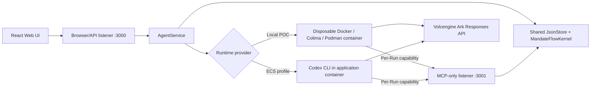

# Volc Agent Launchpad

A minimal Agent platform for three-day middleware hackathons. It provides Agent
CRUD, a browser Playground, persistent workspaces, and Codex CLI backed by the
Volcengine Ark Responses API. Its optional MandateFlow P0 demonstrates
run-scoped authority, provenance-aware tool policy, durable safe receipts, and
deny-before-disclosure enforcement through a separate MCP Gateway.

Run it locally with Docker, Colima, or rootless Podman, or deploy it to
Volcengine ECS.

> [!WARNING]
> This is a single-user proof of concept, not a production identity, audit, or
> hardened sandbox system. Use only the embedded synthetic demo data and a
> scoped model credential. See [SECURITY.md](SECURITY.md) and the
> [MandateFlow limitations](docs/DEMO.md#p0-boundaries).

## Screenshots

### Agent Playground


### Create an Agent


## Features

- React and TypeScript Web UI
- Agent create, edit, start, stop, delete, and multi-turn chat
- Fastify control plane with asynchronous Run state
- Persistent Agent workspaces and Codex sessions
- Disposable Docker, Colima, or Podman container for each local turn
- Optional MandateFlow MCP Gateway with per-Run capabilities, exact permission
  tuples, provenance policy, safe evidence, and narrow completed-Run Retry
- Docker and Terraform deployment paths for Volcengine ECS

## Requirements

- Node.js 22+
- npm 10+
- Docker, Colima, or Podman
- A Volcengine Ark API key and endpoint that supports the Responses API

Codex CLI `0.111.0` is pinned in the Runtime image and is not required on the
host. MandateFlow pins the MCP Server, Node, and Fastify SDK packages to
`2.0.0`.

## Local browser SOP

### 1. Check the local tools

Install Node.js 22+ and one supported container engine, then verify them:

```bash
node --version
npm --version
docker --version        # Docker Desktop, Docker Engine, or Colima
podman --version        # Use this instead when running Podman
```

Only one container engine is required. Codex CLI is already included in the
Runtime image.

### 2. Clone the repository

```bash
git clone <repository-url> volc-agent-launchpad
cd volc-agent-launchpad
```

Skip this step when already working from the repository root.

### 3. Start the POC

```bash
ARK_API_KEY=your-ark-api-key \
ARK_MODEL=ep-your-endpoint-id \
npm run poc
```

The first run installs Node.js dependencies and builds the Runtime image. The
script automatically selects Docker, Colima, or Podman.

### 4. Open the browser

Visit <http://localhost:3000>, or open it from the terminal:

```bash
open http://localhost:3000       # macOS
xdg-open http://localhost:3000   # Linux desktop
```

In the Web UI:

1. Select **Create Agent**.
2. Enter a name, description, and workspace instructions.
3. Select **Create Agent** again.
4. Enter a task in the Playground, for example:

   ```text
   Create a TypeScript hello-world CLI, add a test, and run it.
   ```

The Agent can write files, run commands, and continue the same Codex session in
later messages.

### 5. Stop and resume

Press `Ctrl+C` in the startup terminal. The script removes temporary Runtime
containers but keeps Agent workspaces and conversations.

- macOS state: `~/.volc-agent-launchpad/`
- Linux state: `.local/`
- Custom location: set `LOCAL_POC_DATA_ROOT`

Run the same `npm run poc` command to continue later.

## MandateFlow demo

Start the provenance-policy demo with fresh state and a CRM invocation counter
of `0`:

```bash
ARK_API_KEY=your-ark-api-key \
ARK_MODEL=ep-your-endpoint-id \
npm run demo:mandateflow
```

The launcher chooses Docker, Colima, or Podman, generates the required browser
token, builds the pinned Codex `0.111.0` Runtime, and verifies that the Runtime
can reach the MCP listener. Open <http://localhost:3000>, enter the printed
browser token, and follow the exact Agent setup and prompts in
[docs/DEMO.md](docs/DEMO.md).

When enabled, one Node process starts two Fastify listeners over the same
`JsonStore`, `AgentService`, readiness state, and `MandateFlowKernel`:

- Browser/UI/API listener: loopback-only, port `3000`, authenticated with the
  generated app token.
- MCP-only listener: container-reachable, port `3001`; `/mcp` requires the
  current Run capability and `/healthz` exposes readiness only.

The browser listener never serves `/mcp`, and the MCP listener never serves
browser lifecycle, evidence, Retry, or deletion routes. See
[docs/ARCHITECTURE.md](docs/ARCHITECTURE.md) for the trust boundaries.

## Select a specific container engine

Force Podman when multiple engines are installed:

```bash
CONTAINER_ENGINE=podman \
ARK_API_KEY=your-ark-api-key \
ARK_MODEL=ep-your-endpoint-id \
npm run poc
```

Colima uses `CONTAINER_ENGINE=docker` because it exposes the Docker CLI.

For a clean Linux host, follow the
[rootless Podman setup](docs/LOCAL_POC.md#rootless-podman-on-linux).

## Docker Compose

Create and edit the configuration:

```bash
./scripts/bootstrap-local.sh
```

Required values in `.env`:

```dotenv
ARK_API_KEY=your-ark-api-key
ARK_MODEL=ep-your-endpoint-id
APP_AUTH_TOKEN=replace-with-at-least-24-random-characters
```

Start the application:

```bash
docker compose up --build
```

Open <http://localhost:3000>. Stop it without deleting Agent data:

```bash
docker compose down
```

## Development

```bash
npm install
cp .env.example .env
npm install --global @openai/codex@0.111.0
npm run dev
```

- Web UI: <http://localhost:5173>
- API: <http://localhost:3000>

Use local paths in `.env` when running outside Docker:

```dotenv
APP_DATA_DIR=.data
AGENT_WORKSPACE_ROOT=workspaces
CODEX_HOME=codex-home
```

## Deployment

- [Existing Linux ECS with Docker](docs/DEPLOYMENT.md#existing-linux-ecs)
- [Complete Volcengine environment with Terraform](docs/DEPLOYMENT.md#terraform-deployment)
- [Local Docker, Colima, and Podman details](docs/LOCAL_POC.md)

The existing-ECS script deploys from the current source tree:

```bash
cp .env.example .env.production
./scripts/deploy-existing-ecs.sh .env.production
```

The Terraform path provisions VPC, subnet, security group, ECS, and EIP:

```bash
cp deploy/volcengine/terraform.tfvars.example \
  deploy/volcengine/terraform.tfvars
./scripts/deploy-volcengine.sh
```

## Configuration

| Variable | Default | Purpose |
| --- | --- | --- |
| `ARK_API_KEY` | Required | Ark model API key. |
| `ARK_MODEL` | Required | Responses-capable endpoint or model ID. |
| `ARK_BASE_URL` | Beijing v3 endpoint | Ark OpenAI-compatible API URL. |
| `APP_AUTH_TOKEN` | Empty on loopback when MandateFlow is off | Shared browser token; MandateFlow requires a URL-safe value with at least 256 bits. |
| `RUNTIME_PROVIDER` | `local-process` | `container` for disposable local Runtime containers. |
| `CODEX_SANDBOX_MODE` | `workspace-write` | Codex inner sandbox mode. |
| `CODEX_TIMEOUT_MS` | `600000` | Maximum duration of one turn. |
| `LOCAL_POC_DATA_ROOT` | Platform-specific | Local metadata, workspace, and session directory. |
| `MANDATEFLOW_ENABLED` | `false` | Start the separate MandateFlow MCP listener and issue per-Run authority. |
| `MANDATEFLOW_MCP_BIND_HOST` | `0.0.0.0` | Container-reachable MCP-only bind host. |
| `MANDATEFLOW_MCP_PORT` | `3001` | MCP-only port; it must differ from `PORT`. |
| `MANDATEFLOW_RUNTIME_MCP_URL` | Required when enabled | Runtime-visible MCP origin, without `/mcp`. |
| `MANDATEFLOW_CONTAINER_ADD_HOST` | Empty | Optional Linux Docker `host.docker.internal:host-gateway` mapping. |
| `MANDATEFLOW_CAPABILITY_TTL_MS` | `CODEX_TIMEOUT_MS + 60000` | Per-Run capability lifetime; must exceed the Codex timeout. |

See [.env.example](.env.example) for all Runtime and resource-limit options.

## How it works



The first turn uses `codex exec`; later turns resume the stored Codex thread.
Deleting an Agent archives its workspace under `workspaces/.deleted/`. In
MandateFlow mode, the raw capability exists only in the Run environment; the
store keeps its hash and the browser evidence API returns fingerprints and
redacted causal receipts.

See [docs/ARCHITECTURE.md](docs/ARCHITECTURE.md) for component and extension
boundaries.

## Validation

```bash
npm run check
terraform fmt -check -recursive deploy/volcengine
docker compose config
```

The real Codex/container/MCP compatibility gate is intentionally separate
because it consumes Ark and requires a running container engine:

```bash
ARK_API_KEY=your-ark-api-key \
ARK_MODEL=ep-your-endpoint-id \
npm run test:mandateflow:e2e
```

That live gate was not executed in the current implementation environment;
unit, integration, build, and dual-listener health checks were executed. Run it
on the intended Docker, Colima, or Podman demo host before presenting.

## Documentation

- [Architecture](docs/ARCHITECTURE.md)
- [Local POC](docs/LOCAL_POC.md)
- [MandateFlow demo and rehearsal](docs/DEMO.md)
- [MandateFlow concept and claim boundary](docs/MANDATEFLOW.md)
- [MandateFlow TypeScript implementation blueprint](docs/MANDATEFLOW_IMPLEMENTATION_TYPESCRIPT.md)
- [Deployment](docs/DEPLOYMENT.md)
- [Hackathon extension guide](docs/HACKATHON_EXTENSION_GUIDE.md)
- [Security policy](SECURITY.md)
- [Contributing](CONTRIBUTING.md)

## License

[MIT](LICENSE)
