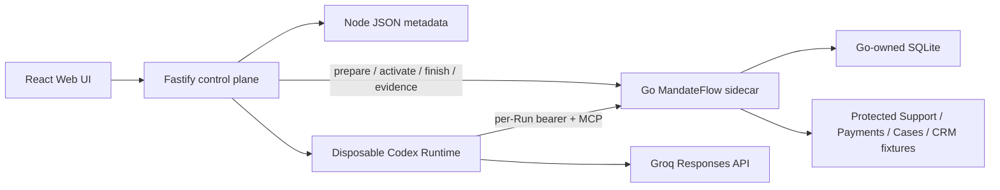

# MandateFlow

A provenance-sensitive mandate gateway built into Agent Launchpad for TikTok
TechJam 2026 Track 1. The baseline still provides Agent CRUD, a browser
Playground, persistent workspaces, and Codex CLI backed by the Groq
Responses API. MandateFlow adds a Go reference monitor that stops forbidden
cross-tool data flows before a protected operation runs.

Run it locally with Docker, Colima, or rootless Podman, or deploy it to
Volcengine ECS.

> [!WARNING]
> This is a single-user proof of concept, not a production authorization or DLP
> system. Its claim applies only to the five typed fixture operations that are
> exclusively reachable through the gateway. Do not use production data or
> credentials. See [SECURITY.md](SECURITY.md).

## Screenshots

### Agent Playground


### Create an Agent


## Features

- React and TypeScript Web UI
- Agent create, edit, start, stop, delete, and multi-turn chat
- Fastify control plane with asynchronous Run state
- Persistent Agent workspaces and Codex sessions
- Disposable Docker, Colima, or Podman container for each local turn
- Go Streamable HTTP MCP gateway with per-Run bearer capabilities
- Immutable Run grants, server-owned reference lineage, and a pinned flow policy
- Go-owned SQLite receipts proving pre-execution allow/deny decisions
- Explicit retry with fresh authority and durable provenance continuity
- Docker and Terraform deployment paths for Volcengine ECS

## Requirements

- Node.js 22+
- npm 10+
- Docker, Colima, or Podman
- A Groq API key; the model defaults to `openai/gpt-oss-120b`

Codex CLI is included in the Runtime image and is not required on the host.

## Local browser SOP

### 1. Check the local tools

Install Node.js 22+ and one supported container engine, then verify them:

```bash
node --version
npm --version
docker --version        # Docker Desktop, Docker Engine, or Colima
podman --version        # Use this instead when running Podman
```

Only one container engine is required. Codex CLI is already included in the
Runtime image.

### 2. Clone the repository

```bash
git clone <repository-url> volc-agent-launchpad
cd volc-agent-launchpad
```

Skip this step when already working from the repository root.

### 3. Start the POC

```bash
export APP_AUTH_TOKEN="$(node -e 'process.stdout.write(require("node:crypto").randomBytes(24).toString("base64url"))')"
GROQ_API_KEY=your-groq-api-key \
npm run poc
```

The first run installs Node.js dependencies, runs the Go test target, and builds
the Runtime and MandateFlow images. The script automatically selects Docker,
Colima, or Podman. Enter `APP_AUTH_TOKEN` in the browser unlock screen.

### 4. Open the browser

Visit <http://localhost:3000>, or open it from the terminal:

```bash
open http://localhost:3000       # macOS
xdg-open http://localhost:3000   # Linux desktop
```

In the Web UI:

1. Select **Create Agent**.
2. Enter a name, description, and workspace instructions.
3. Select **Create Agent** again.
4. Select the first starter prompt, which runs the deterministic proof:

   ```text
   Run the MandateFlow verification workflow. First, list the open Support ticket,
   transform its subject reference with cases.lookup_subject, and resolve that Case
   reference through CRM. Next, list Payment failures, transform one Payment reference
   with the same Case tool, and attempt the same CRM resolution. If policy denies it,
   use payments.aggregate_failures and finish the brief. Report policy outcomes, not
   protected identifiers.
   ```

The decision journal should show Support → Case → CRM as `ALLOW`, Payment →
Case → CRM as `FLOW_DENIED`, the denied CRM counter unchanged, and aggregate
recovery succeeding. Use **Retry denied call** to prove that a new Runtime and
capability cannot erase the Payment lineage.

### 5. Stop and resume

Press `Ctrl+C` in the startup terminal. The script removes temporary Runtime
containers, the Go sidecar, and its private network, while keeping Agent
workspaces, conversations, and the MandateFlow SQLite journal.

- macOS state: `~/.volc-agent-launchpad/`
- Linux state: `.local/`
- Custom location: set `LOCAL_POC_DATA_ROOT`

Run the same `npm run poc` command to continue later.

### Select a specific container engine

Force Podman when multiple engines are installed:

```bash
CONTAINER_ENGINE=podman \
APP_AUTH_TOKEN="$APP_AUTH_TOKEN" \
GROQ_API_KEY=your-groq-api-key \
npm run poc
```

Colima uses `CONTAINER_ENGINE=docker` because it exposes the Docker CLI.

For a clean Linux host, follow the
[rootless Podman setup](docs/LOCAL_POC.md#rootless-podman-on-linux).

## Docker Compose (baseline profile)

Docker Compose and ECS retain the starter profile and do not start the
MandateFlow sidecar. The submitted Track 1 path is `npm run poc` with disposable
local Runtime containers.

Create and edit the configuration:

```bash
./scripts/bootstrap-local.sh
```

Required values in `.env`:

```dotenv
GROQ_API_KEY=your-groq-api-key
GROQ_MODEL=openai/gpt-oss-120b
APP_AUTH_TOKEN=replace-with-at-least-24-random-characters
```

Start the application:

```bash
docker compose up --build
```

Open <http://localhost:3000>. Stop it without deleting Agent data:

```bash
docker compose down
```

## Development

```bash
npm install
cp .env.example .env
npm install --global @openai/codex@0.111.0
npm run dev
```

- Web UI: <http://localhost:5173>
- API: <http://localhost:3000>

Use local paths in `.env` when running outside Docker:

```dotenv
APP_DATA_DIR=.data
AGENT_WORKSPACE_ROOT=workspaces
CODEX_HOME=codex-home
```

## Deployment

- [Existing Linux ECS with Docker](docs/DEPLOYMENT.md#existing-linux-ecs)
- [Complete Volcengine environment with Terraform](docs/DEPLOYMENT.md#terraform-deployment)
- [Local Docker, Colima, and Podman details](docs/LOCAL_POC.md)

The existing-ECS script deploys from the current source tree:

```bash
cp .env.example .env.production
./scripts/deploy-existing-ecs.sh .env.production
```

The Terraform path provisions VPC, subnet, security group, ECS, and EIP:

```bash
cp deploy/volcengine/terraform.tfvars.example \
  deploy/volcengine/terraform.tfvars
./scripts/deploy-volcengine.sh
```

## Configuration

| Variable | Default | Purpose |
| --- | --- | --- |
| `GROQ_API_KEY` | Required | Groq API key. |
| `GROQ_MODEL` | `openai/gpt-oss-120b` | Responses-capable Groq model. |
| `GROQ_BASE_URL` | `https://api.groq.com/openai/v1` | Groq OpenAI-compatible API URL. |
| `APP_AUTH_TOKEN` | Empty on loopback | Shared demo token; use 24+ random characters remotely. |
| `MANDATEFLOW_ENABLED` | `false` | Enables fail-closed Run lifecycle integration. `npm run poc` sets it to `true`. |
| `MANDATEFLOW_CONTROL_URL` | `http://127.0.0.1:3002` | Host-only Go lifecycle/evidence endpoint. |
| `MANDATEFLOW_RUNTIME_MCP_URL` | `http://mandateflow-gateway:3001/mcp` | MCP URL visible inside the private Runtime network. |
| `RUNTIME_PROVIDER` | `local-process` | `container` for disposable local Runtime containers. |
| `CODEX_SANDBOX_MODE` | `workspace-write` | Codex inner sandbox mode. |
| `CODEX_TIMEOUT_MS` | `600000` | Maximum duration of one turn. |
| `LOCAL_POC_DATA_ROOT` | Platform-specific | Local metadata, workspace, and session directory. |

See [.env.example](.env.example) for all Runtime and resource-limit options.

## How it works



Node owns only UI/orchestration metadata. Go exclusively owns grants, capability
digests, reference lineage, fixture counters, and redacted receipts. Raw Run
capabilities are injected only into the matching Runtime process environment.

See [docs/ARCHITECTURE.md](docs/ARCHITECTURE.md) for component and extension
boundaries.

## Validation

```bash
npm run test:server
npm run check:fast
npm run check
APP_AUTH_TOKEN="$APP_AUTH_TOKEN" npm run check:mandateflow:e2e  # running POC; consumes Groq tokens
terraform fmt -check -recursive deploy/volcengine
docker compose config
```

Use `npm run test:server:watch` while iterating on the server. `check:fast`
runs TypeScript typechecks, server tests, Go formatting, `go vet`, and race
tests without production bundle builds, Docker image builds, or Groq requests.
It requires a local Go 1.23+ toolchain. Keep `npm run check` as the complete
local gate before opening a pull request.

## Documentation

- [Architecture](docs/ARCHITECTURE.md)
- [Local POC](docs/LOCAL_POC.md)
- [Three-minute demo and acceptance evidence](docs/DEMO.md)
- [Deployment](docs/DEPLOYMENT.md)
- [Hackathon extension guide](docs/HACKATHON_EXTENSION_GUIDE.md)
- [Security policy](SECURITY.md)
- [Contributing](CONTRIBUTING.md)

## License

[MIT](LICENSE)
