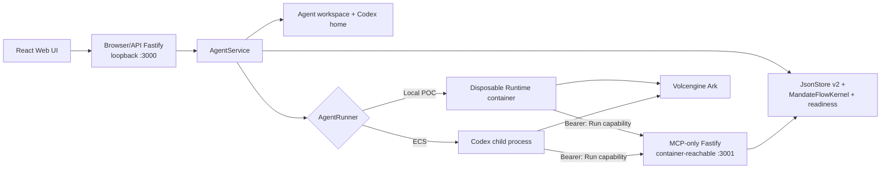

# Architecture

Volc Agent Launchpad is a single-node control plane for hackathon use.
MandateFlow is an optional P0 policy path inside the same Node process. It adds
a second, MCP-only listener but deliberately keeps one trusted state owner.



The browser and MCP apps share the exact `JsonStore`, `MandateFlowKernel`,
`AgentService` lifecycle, and readiness object. The MCP listener starts before
the browser listener, and shutdown first stops issuance/cancels Runs, then
closes MCP, then closes the browser app. A durable-store failure makes the MCP
Gateway unready and stops active authority.

## Components

### Web UI

Lists Agents, manages lifecycle actions, submits prompts, and polls asynchronous
Runs. It never receives the Ark API key.

### Fastify API

Validates requests, protects remote demos with a shared bearer token, and
serves the compiled Web UI. In MandateFlow mode this listener is loopback-only.
The app token protects browser APIs but is not user identity or a Run
capability. It exposes safe evidence at `GET /api/runs/:id/mandateflow` and a
bodyless `POST /api/runs/:id/retry`; it never serves `/mcp`.

### MandateFlow MCP Gateway

The second Fastify app exposes only `GET /healthz` and MCP at `/mcp`. It uses
the exact-pinned `@modelcontextprotocol/server`,
`@modelcontextprotocol/node`, and `@modelcontextprotocol/fastify` packages at
`2.0.0`; the Runtime image pins Codex CLI `0.111.0`.

Every protected request must carry exactly one current Run capability. The
Gateway hashes it, authenticates the active Run/grant/Agent/context linkage,
checks an exact `(tool, action, resourceKind)` tuple, validates opaque reference
integrity, and evaluates provenance before a fixture can run. A completed
secure Run binds its Codex thread to the context, and Retry verifies that same
thread binding. Host and optional Origin are restricted to configured Runtime
and loopback origins. The raw capability and full protected references are not
returned by browser evidence.

The registered P0 tools are:

- `support.list_tickets`
- `payments.list_failures`
- `cases.lookup_subject`
- `crm.resolve_customer`
- `payments.aggregate_failures`

Support and Payment both produce the same opaque subject shape, and the same
Case transformation produces the same opaque Case shape. The frozen policy
allows Support-derived CRM resolution but denies Payment-derived CRM resolution
at `PRE_EXECUTION` with `NOT_INVOKED`; the embedded CRM counter therefore does
not increment on denial.

### AgentService

Coordinates lifecycle state, persistence, workspaces, and Runs. One Agent can
have only one active Run. When MandateFlow is enabled, issuance atomically
commits the Run, frozen mandate/context, grant, and capability hash before the
Runtime starts. The raw capability is passed only in that Run's private
environment. Terminal status invalidates it.

```text
ready -> busy -> ready
  |       |
  v       v
stopped  error
```

Interrupted Runs become `cancelled` after a restart. For a MandateFlow Run, its
grant is additionally terminalized as `restart_interrupted`, invalidating the
capability. Retry is deliberately narrower than a new prompt: a
completed predecessor with a persisted Payment-flow denial gets a new Runtime,
Run, grant, and capability, while retaining the same policy context and Codex
thread. Its permissions are limited to `crm.resolve_customer` and
`payments.aggregate_failures`, and the server generates the Retry prompt.

### Storage

```text
data/launchpad.json       Agent, message, and Run metadata
workspaces/AgentID/       Agent-created files
workspaces/.deleted/      Archived deleted workspaces
codex-home/               Codex configuration and sessions
```

`JsonStore` serializes writes and atomically replaces one JSON file. Database v2
stores the policy contexts, Run grants, hashed protected references, receipts,
and fixture counters beside the existing Agent/Run records. It supports one
process and one writer only.

### Runtime providers

- `CodexRunner` runs Codex inside the application container for ECS.
- `ContainerCodexRunner` starts one disposable Docker, Colima, or Podman
  container for every local turn.

Both providers use argv-only process execution, bound output and time, resume
the stored Codex thread, and escalate termination after a grace period. The
container runner uses Run-specific names/labels and selects the Runtime-visible
MCP host by engine:

| Engine | Runtime MCP host | Extra mapping |
| --- | --- | --- |
| Docker Desktop / Colima | `host.docker.internal` | None |
| Podman | `host.containers.internal` | None |
| Linux Docker | `host.docker.internal` | `host.docker.internal:host-gateway` |

## Deployment profiles

| Profile | Control plane | Agent execution |
| --- | --- | --- |
| Local POC | Host Node.js | Disposable local container |
| ECS | Application container | Codex process in the same container |
| Local development | Host Node.js | Host Codex process |

## Extension seams

| Track | Primary seam | Expected change |
| --- | --- | --- |
| Glass Box | `AgentRunner`, `AgentRun` | Emit and display correlated execution events. |
| Bouncer | API routes, Agent ownership | Add identity and server-side authorization. |
| Kill Switch | `AgentRunner` | Add threat-specific policy or a stronger sandbox. |

The current container or ECS instance is the POC trust boundary. Ordinary
containers are not hardened multi-tenant isolation.

## P0 boundaries

MandateFlow proves one linear source → Case → CRM provenance path over embedded
synthetic fixtures. It does not provide a general graph engine, external-system
atomicity, filesystem `fsync`, tamper-evident storage, replay protection,
exactly-once semantics, general DLP, multi-user identity/isolation, or TLS. The
local MCP bridge uses plain HTTP inside the trusted demo host/container
boundary.

The 24-hour policy context has no renewal path; start a fresh demo launcher for
an expired or rehearsed context. Retry is proven only while the same Node
process retains the recognized completed Run and the Codex thread retains the
exact prior opaque Case handle. Retry after a Node restart is not claimed.
