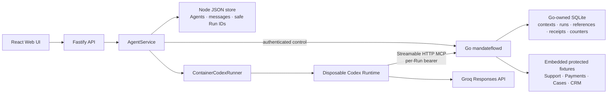

# Architecture

MandateFlow keeps the starter's browser, Fastify orchestration, workspaces,
Codex Runtime, and Groq inference path. A separate Go process is the reference
monitor for five protected MCP operations.



## Trust and state ownership

The browser, model, Runtime filesystem, prompts, tool arguments, and opaque
references supplied by Codex are untrusted. Fastify is a trusted lifecycle
adapter, but it does not decide policy. The Go gateway authenticates every MCP
request, loads immutable authority and server-owned reference ancestry from
SQLite, applies the pinned policy, and invokes a fixture only after admission.

| Owner | State |
| --- | --- |
| Node `JsonStore` | Agent/message metadata, Codex thread ID, safe Go foreign IDs, fingerprints, retry display state |
| Go SQLite | Frozen policy contexts, immutable grants, capability digests, protected-reference mappings and ancestry, receipts, fixture counters |
| Runtime environment | One raw `MANDATEFLOW_RUN_CAPABILITY` for the current Run |

Node never opens the SQLite database. Go never mutates `launchpad.json`. Raw
capabilities, references, private fixture targets, and protected results are not
returned by the evidence API.

## Authority lifecycle

```text
queued -> Go prepare -> persist safe IDs -> Go activate -> spawn Runtime
Runtime result -> Go finish(COMPLETED) -> publish assistant message
Runtime failure/cancel -> Go finish(FAILED/CANCELLED) -> publish terminal state
```

`runId` is the lifecycle and cancellation key. Node generates a random Run
capability and sends only its SHA-256 digest to Go. The raw value is passed in
the matching Runtime spawn environment, while Codex configuration contains only
the environment-variable name. Node refuses to publish a clean completion
until Go acknowledges terminalization. An unconfirmed terminalization blocks
later Runtime creation for that Agent and is reconciled by exact Run ID after
Go recovers. On Go startup, any prior `PREPARED` or `ACTIVE` Run becomes
`GATEWAY_RESTART`, invalidating its bearer before MCP readiness.

An explicit Retry creates a new Run, Runtime, immutable grant, and capability.
Go derives its maximum scope and policy context from the completed source Run;
the prior opaque Case reference therefore resolves to the same stored Payment
lineage and remains denied.

## Protected request path

The fixed MCP registry is:

1. `support.list_tickets`
2. `payments.list_failures`
3. `cases.lookup_subject`
4. `crm.resolve_customer`
5. `payments.aggregate_failures`

For a tool call, Go validates active bearer authority, the exact
`(tool, action, resourceKind)` grant tuple, reference format/kind/context/expiry,
and inherited classifications. Support-derived Case references may reach CRM.
Payment-derived Case references carry `PAYMENT_AGGREGATE_ONLY`, so the same CRM
method is denied before the fixture counter changes. The aggregate tool is the
safe recovery path.

Allowed fixture work, its receipt, counter update, and any derived reference are
committed in one SQLite transaction before disclosure. Authenticated denials
commit a receipt with `PRE_EXECUTION`, `NOT_INVOKED`, and equal before/after
counters. Missing or invalid authentication receives one generic HTTP `401`.

## Network boundary

The local launcher creates an instance-specific private bridge network. Runtime
containers and the sidecar join it; MCP is reachable through
`http://mandateflow-gateway:3001/mcp`. The MCP port is not host-published. The
control listener is published only on loopback port 3002 and requires a separate
boot bearer. Runtime containers receive neither the control bearer nor
`APP_AUTH_TOKEN`.

This is a single-host POC boundary, not hardened multi-tenant isolation. It does
not protect raw values copied into unprotected files/text/network paths, prevent
active-Runtime bearer theft, or provide exactly-once execution.

## Deployment profiles

| Profile | MandateFlow status |
| --- | --- |
| `npm run poc` local containers | Submitted P0; Go sidecar and private network enabled |
| Local development | Baseline by default; enable only with a manually started sidecar |
| Docker Compose / ECS | Starter baseline only; production sidecar deployment is P1 |
