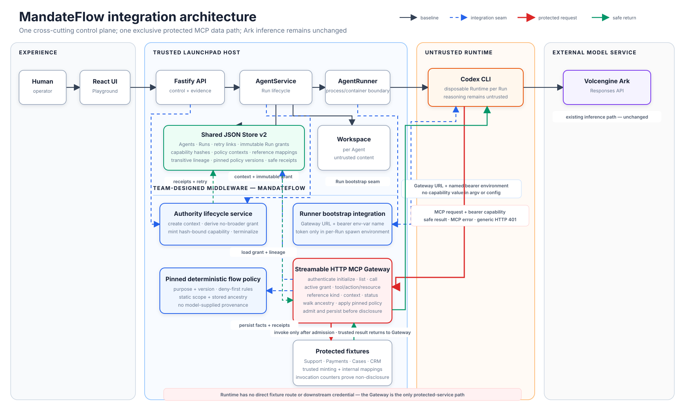

# MandateFlow

### TikTok TechJam 2026 · Track 1 — Agent Launchpad middleware

**Stop unsafe data composition before an Agent reaches a protected tool.**

MandateFlow is a hackathon-scale proof of concept built on the provided Agent
Launchpad starter. It adds a provenance-sensitive authorization gateway to a
working Agent platform: a Support-derived Case may reach CRM, while a
Payment-derived Case is denied before CRM is invoked—even when both calls use
the same public resource type and the same CRM method.

The proof is functional end to end:

```text
Browser → React Playground → Fastify → AgentService
        → disposable Codex Runtime → Go MCP Gateway → protected fixtures
```

The Go gateway owns the policy decision, server-side reference lineage, and
redacted receipts. The browser and the model never decide whether a protected
cross-tool flow is safe.

> The same Agent, with the same CRM permission, calling the same CRM method is
> allowed or denied based solely on the trusted provenance of its input — and
> recreating the Runtime cannot erase that provenance.

## Judge's fast path

The intended judging path is one local command, one browser scenario, and less
than three minutes of live interaction.

### Requirements

- macOS or Linux
- Node.js 22+ and npm 10+
- Docker, Colima, or rootless Podman
- A Groq API key for the live Agent demonstration (`container` Runtime profile)
- No Groq key is needed for the deterministic middleware-only fallback

### Start the live Agent demonstration

```bash
git clone https://github.com/tradaokamsa/MandateFlow.git
cd MandateFlow/CodeJam

export APP_AUTH_TOKEN="$(node -e 'process.stdout.write(require("node:crypto").randomBytes(24).toString("base64url"))')"
export RUNTIME_PROVIDER=container
export GROQ_API_KEY='your-real-groq-api-key'
export GROQ_MODEL='openai/gpt-oss-120b'
npm run poc
```

> **Test this on your own key before the live demo.** On a free/on-demand
> Groq tier, `gpt-oss-120b` can return HTTP `413 Request too large` (a single
> Codex turn with the full tool schema runs ~9,100 tokens, above that tier's
> 8,000 TPM cap) — `gpt-oss-20b` fit under that specific cap in our testing.
> This is a per-account rate limit, not a code defect, so a higher tier or a
> different key may not hit it at all. Run the coding prompt once before
> judging to confirm your key/model combination.

The launcher installs dependencies when needed, builds the Go sidecar and
starts a disposable Codex Runtime backed by Groq, creates an instance network,
and starts the production Web/API bundle at <http://localhost:3000>. Enter the
generated `APP_AUTH_TOKEN` in the browser unlock screen. The startup log must
say `Runtime provider: container`; if it says `fixture`, the Groq key was not
loaded. The script automatically selects Docker, Colima, or Podman; set
`CONTAINER_ENGINE=podman` to force Podman.

If a local checkout stores the raw key in `api_key.txt` at the repository root,
load it without printing it:

```bash
export GROQ_API_KEY="$(tr -d '\r\n' < ../api_key.txt)"
```

The credential-free fixture Runtime remains available for middleware-only
verification:

```bash
export RUNTIME_PROVIDER=fixture
npm run poc
```

### Run it end to end

1. Leave `npm run poc` running, open <http://localhost:3000>, and enter the
   generated `APP_AUTH_TOKEN` in the unlock screen.
2. Select **Create Agent**, enter any name/description/instructions, and create
   the Agent. The default demo owner is `user-a`.
3. Select **Start** for the new Agent. Send the coding starter prompt
   **Create a small TypeScript CLI that prints a weather summary from sample
   JSON.** Watch **Runtime activity** show the queued, authorization, Runtime,
   tool-work, and finalization stages, then inspect the workspace result.
4. Select **New secure workflow** so the next run starts with a fresh mandate
   and policy context.
5. In the proof console, select **Run MandateFlow proof**. Wait for the Run to
   complete, then open the decision journal and expand the receipts.
   > The proof calls five protected tools in one turn. In one test run this
   > tripped `output_parse_failed` on `gpt-oss-20b` via the live `container`
   > Runtime — consistent with reports of `tool_use_failed` on long tool
   > chains for Groq's gpt-oss models, though we only reproduced it once and
   > it may be model/tier/account dependent. If it happens on your key,
   > restart with `RUNTIME_PROVIDER=fixture` (no Groq key needed) — it drives
   > the identical Go Gateway/SQLite path through a deterministic script and
   > is the reliable fallback for judging if the live model path is flaky on
   > the day.
6. Select **Retry denied call** and show that the Payment-derived CRM call is
   denied again with fresh Run authority but the same policy context and
   lineage.
7. Select **Revoke mandate**, confirm, then select **New secure workflow**.
   Send and Retry are blocked while revoked; the next proof starts with a fresh
   policy context and old references cannot cross into it.

If you want to run the prompt manually, use the first starter prompt:

```text
Run the MandateFlow verification workflow. First, list the open Support ticket,
transform its subject reference with cases.lookup_subject, and resolve that Case
reference through CRM. Next, list Payment failures, transform one Payment reference
with the same Case tool, and attempt the same CRM resolution. If policy denies it,
use payments.aggregate_failures, then fetch a fresh Support ticket, transform
it, and resolve it through CRM. Report policy outcomes, not protected
identifiers.
```

### User flows for the demo

The demo has two connected stories: first, a real Codex Agent performs a small
workspace change through the Groq Runtime; second, the same Agent platform
proves that MandateFlow allows trusted Support data, blocks the same-looking
Payment data at the protected boundary, and recovers safely without exposing
sensitive references. Open the Runtime activity rail for the coding run, then
use the completed proof's console and decision journal for the security story.

#### Flow 1 — Establish a secure workflow

Create an Agent, select **Start**, then point out the
**MandateFlow ready** header and server-derived Mandate Summary. This establishes
that the Agent Runtime and a fresh policy context are ready before any protected
tool is called.

#### Flow 2 — Demonstrate the Agent Runtime

Send **Create a small TypeScript CLI that prints a weather summary from sample
JSON.** Show the timestamped Runtime activity stages, the assistant response,
and the changed workspace. This is the live Codex/Groq portion of the demo; it
is not available in `fixture` mode.

#### Flow 3 — Follow a trusted Support path

Run **MandateFlow proof** and show `Support → Case → CRM` as `ALLOW`. The CRM
counter moves from `0 → 1`, and the allowed receipt is marked `COMPLETED`.

#### Flow 4 — Block unsafe re-identification

The Agent uses the same public Case type and the same CRM method for a
Payment-derived reference. Static scope is still `ALLOW`, but trusted
provenance is `DENY`: rule `NO_PAYMENT_REIDENTIFICATION` blocks the call at
`PRE_EXECUTION`, the outcome is `NOT_INVOKED`, and the CRM counter remains
`1 → 1`. This is the key moment: the gateway stops the flow before the
protected fixture runs.

#### Flow 5 — Recover with the least privilege path

Show `payments.aggregate_failures` succeeding as the safe alternative. The
Agent then fetches a fresh Support ticket and completes a second CRM resolution;
the counter moves from `1 → 2`. No Payment reference is re-identified.

#### Flow 6 — Retry without inheriting trust

Select **Retry denied call**. The retry has a new Run, Runtime, grant, and
capability fingerprint, while preserving the policy context and Payment
lineage. It is denied again without repeating the Payment or Case derivation.

#### Flow 7 — Revoke and start clean

Select **Revoke mandate**, confirm it, and show that Send and Retry are locked.
Select **New secure workflow** to create a fresh policy context. The old
redacted receipts remain useful evidence, but old references cannot cross into
the new workflow.

The memorable takeaway is: **same tool, same public type, different trusted
provenance — different authorization outcome.**

For a terminal-only acceptance check against an already running POC, open a
second terminal, paste the same token, and run:

```bash
cd MandateFlow/CodeJam
export APP_AUTH_TOKEN='paste-the-token-used-by-npm-run-poc'
npm run check:mandateflow:e2e
```

When the walkthrough is finished, press `Ctrl+C` in the POC terminal. Temporary
Runtime containers, the Go sidecar, and its private network are removed; Agent
workspaces and the redacted journal remain on disk.

For the exact acceptance walkthrough, see
[CodeJam/docs/DEMO.md](CodeJam/docs/DEMO.md).

For the local operator SOP, progress/recovery behavior, and troubleshooting,
see [CodeJam/README.md](CodeJam/README.md). The completed browser audit and
captured evidence are recorded in [audit/UX-AUDIT.md](audit/UX-AUDIT.md).

## What problem is solved?

An Agent may legitimately need several tools in one workflow, but a tool
allowlist alone cannot express every data-flow rule. In the demo, Support cases
may be re-identified for follow-up, while Payment failures may be reported only
in aggregate. A naive tool-scope check sees that both workflows are allowed to
call `cases.lookup_subject` and `crm.resolve_customer`; it does not know where
the Case reference came from after the transformation.

MandateFlow changes the authorization unit from an isolated tool call to:

```text
typed tool call + immutable Run grant + server-owned reference lineage
```

Each secure workflow receives a root mandate, each Run receives an attenuated
grant and short-lived capability, and each protected reference is minted and
resolved only by the Go gateway. The gateway evaluates static scope and
provenance before invoking the fixture. Authenticated denials are persisted as
redacted receipts; unauthenticated or expired capabilities receive a generic
HTTP `401` without policy disclosure.

## Why this is middleware

The middleware is not a screen or a hard-coded demo message. It executes at a
trusted boundary in the real Agent path:

- **Fastify / AgentService:** prepares, activates, finishes, retries, and
  revokes authority around real Agent Runs.
- **AgentRunner / Runtime:** injects only the matching per-Run capability and
  connects the disposable Runtime to the private MCP network.
- **Go MandateFlow Gateway:** authenticates the capability, loads immutable
  grants and reference ancestry from SQLite, evaluates policy, and blocks
  forbidden calls before the protected fixture runs.
- **Protected data path:** Support, Payments, Cases, and CRM fixtures are
  reachable only through the gateway; a denied call cannot increment the CRM
  counter.
- **Evidence path:** Go atomically records the decision, outcome, counters, and
  derived lineage in a redacted receipt journal.

The original starter experience remains intact: Agent CRUD, lifecycle actions,
Playground chat, persistent workspaces, Codex sessions, and model execution.
Only the UI needed to operate and explain the middleware was added.

## Architecture and trust boundary



The one-page diagram above shows the integration seams and trust boundary. The
short version is:

| Component | Owns |
| --- | --- |
| React / Codex / Runtime inputs | Untrusted prompts, tool arguments, and opaque references. |
| Node `JsonStore` | Agent/message metadata plus safe foreign IDs and fingerprints; it never opens the policy database. |
| Go sidecar + SQLite | Mandates, Run grants, capability digests, ownership-bound fixtures, reference ancestry, receipts, and counters. |
| Gateway | The only enforcement point for the five protected MCP operations. |

The local launcher gives each instance a private bridge network. In the live
container profile the MCP port is private to that network; in the fixture
profile it is published only on loopback so the Node fixture runner can cross
the same HTTP boundary. The Go control listener is loopback-only. Each live
Runtime mounts only its selected Agent workspace and private Codex home.

Read the deeper boundary and lifecycle details in
[CodeJam/docs/ARCHITECTURE.md](CodeJam/docs/ARCHITECTURE.md) and the design
record in [mandateflow_docs/MANDATEFLOW.md](mandateflow_docs/MANDATEFLOW.md).

## Track 1 rubric alignment

The submission is organized around the Track 1 judging weights:

| Weight | Criterion | Evidence in this repository |
| ---: | --- | --- |
| **40%** | End-to-end middleware behavior | Browser-triggered Codex Run → real Streamable HTTP MCP Gateway → allowed protected operation, pre-execution provenance denial, and safe recovery. |
| **25%** | Technical design and integration | Explicit Fastify/AgentService/AgentRunner seams, immutable authority contract, exclusive protected path, trust-boundary diagram, and failure semantics. |
| **20%** | Verification and robustness | Go unit/integration tests for scope, provenance, forged references, ownership, revocation, retry continuity, redaction, non-invocation, and HTTP authentication; TypeScript tests for lifecycle and runtime wiring. |
| **15%** | Demo and reproducibility | `npm run poc`, deterministic typed fixtures, documented Docker/Colima/Podman path, three-minute script, automated checks, and honest limitations. |

Track 1 asks teams to preserve the starter, implement real behavior in a
backend/Runtime/data/infrastructure path, show a normal and failure/denial or
recovery case, add automated tests, keep secrets out, and document a focused
middleware story. MandateFlow is intentionally deep rather than broad.

## Verification

Run from `CodeJam/`:

```bash
# Fast local gate: TypeScript, server/web tests, gofmt, go vet, and race tests
npm run check:fast

# Complete gate: fast checks plus production Web/API builds
npm run check

# Focused Go middleware check
npm run check:mandateflow

# Against an already running credential-free POC
APP_AUTH_TOKEN="$APP_AUTH_TOKEN" npm run check:mandateflow:e2e
```

The E2E check prints the initial and retry Run IDs, shared policy-context ID,
unchanged CRM counter, denial receipt IDs, and the fresh post-revocation
context. It is separate from `npm run check` because it starts the local POC;
the default fixture path does not require a model request. Set
`RUNTIME_PROVIDER=container` to run the optional live Codex/Groq variant.

### What the Gateway actually decided — one real run

`GET /api/runs/:id/evidence` from a completed proof Run, trimmed to the
field that matters per protected call:

```json
{
  "crmCounter": 2,
  "receipts": [
    { "tool": "support.list_tickets",      "decision": "ALLOW", "ruleId": null },
    { "tool": "cases.lookup_subject",      "decision": "ALLOW", "ruleId": null },
    { "tool": "crm.resolve_customer",      "decision": "ALLOW", "ruleId": null },
    { "tool": "payments.list_failures",    "decision": "ALLOW", "ruleId": null },
    { "tool": "cases.lookup_subject",      "decision": "ALLOW", "ruleId": null },
    { "tool": "crm.resolve_customer",      "decision": "DENY",  "ruleId": "NO_PAYMENT_REIDENTIFICATION",
      "reason": "Payment-derived references are aggregate-only and cannot be resolved through CRM" },
    { "tool": "payments.aggregate_failures","decision": "ALLOW", "ruleId": null },
    { "tool": "support.list_tickets",      "decision": "ALLOW", "ruleId": null },
    { "tool": "cases.lookup_subject",      "decision": "ALLOW", "ruleId": null },
    { "tool": "crm.resolve_customer",      "decision": "ALLOW", "ruleId": null }
  ]
}
```

Ten calls to the same protected tool set, one policy context. The single
`DENY` sits between two identical-looking `crm.resolve_customer` calls —
same tool, same permission, same public reference type — and the receipt
names the exact rule and the reason. `crmCounter: 2` confirms the denied
call never reached the fixture: only the two Support-derived resolutions
incremented it.

## Honest scope

This is a single-host, single-user POC and the security claim is intentionally
bounded to the five typed fixture operations exclusively reachable through
MandateFlow. It is not a production identity provider, general DLP engine,
arbitrary MCP proxy, exactly-once system, or hardened multi-tenant sandbox.

Known limits include crash-time revocation, replay prevention, raw values copied
into unprotected files/text/network paths, and platforms where inner Codex
Landlock is unavailable. Docker Compose and ECS retain the starter baseline;
the submitted Track 1 path is the local disposable-Runtime profile.

See [CodeJam/SECURITY.md](CodeJam/SECURITY.md) before using any real data or
credentials. Never commit `.env`, API keys, bearer tokens, or generated runtime
state.

## Repository map

```text
CodeJam/                         React UI, Fastify API, Codex runners, launcher
middleware/mandateflow/          Go sidecar, MCP gateway, policy, SQLite store
mandateflow_docs/                Design rationale, contracts, and diagrams
MIDDLEWARE_TESTING.md            Focused test and live-E2E commands
```

Useful reading order:

1. [Three-minute demo](CodeJam/docs/DEMO.md)
2. [Architecture](CodeJam/docs/ARCHITECTURE.md)
3. [MandateFlow design](mandateflow_docs/MANDATEFLOW.md)
4. [Go gateway README](middleware/mandateflow/README.md)
5. [Local POC details](CodeJam/docs/LOCAL_POC.md)

## License

[MIT](LICENSE)
