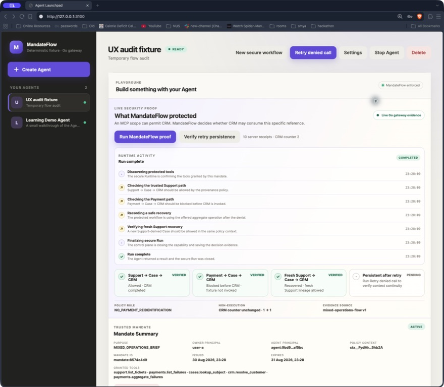
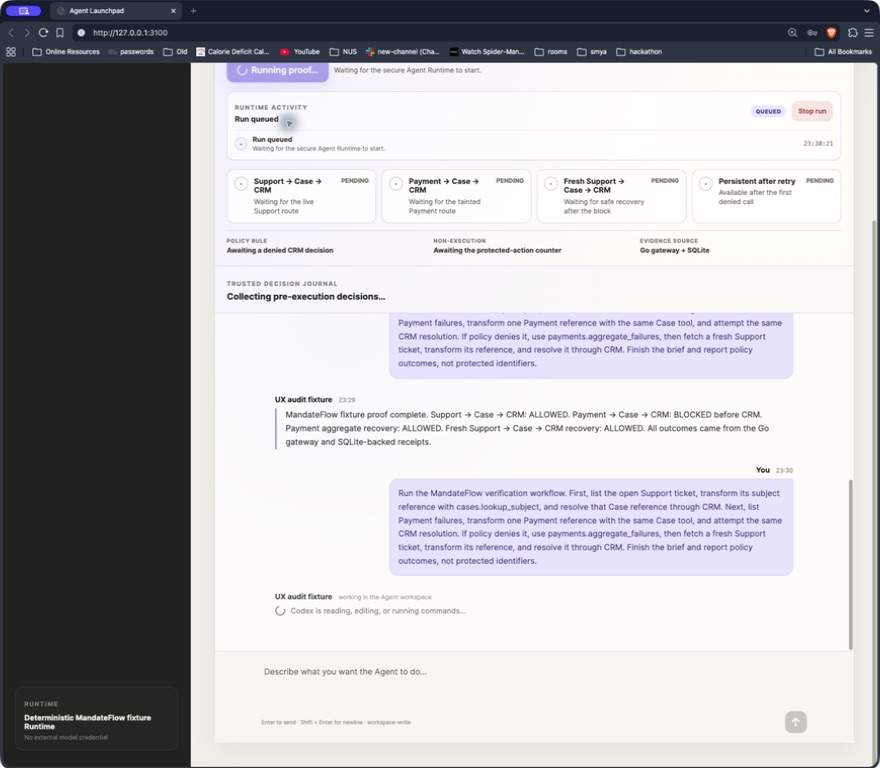
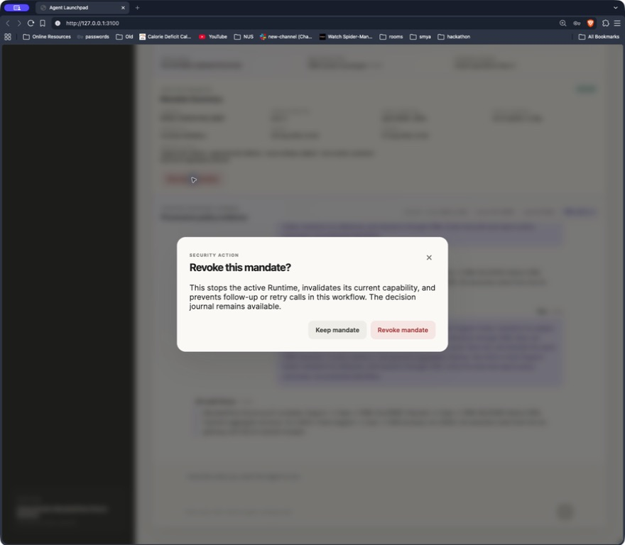
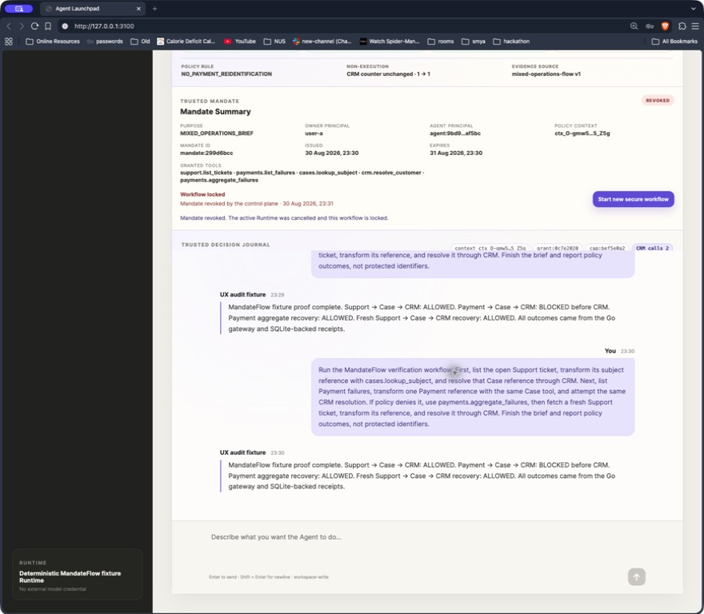
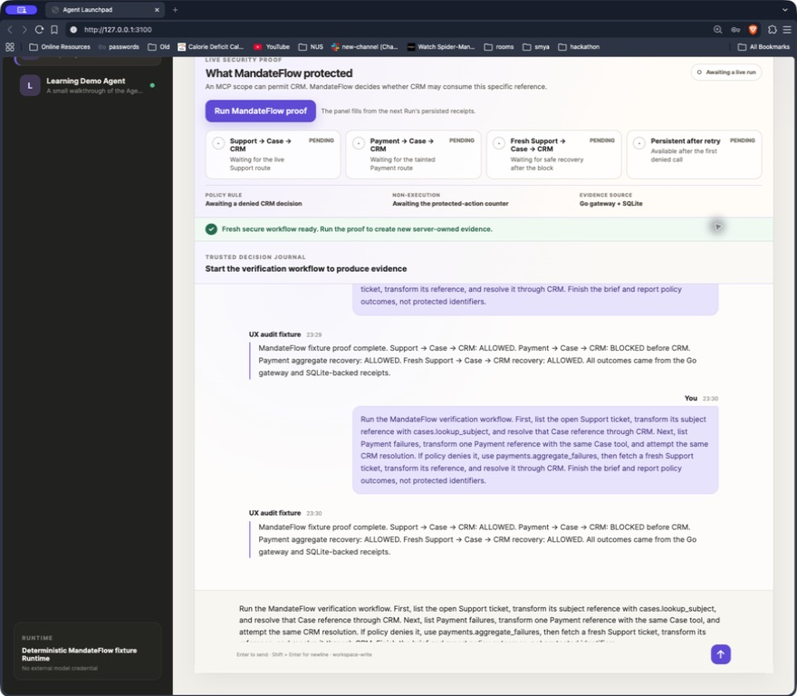

# MandateFlow workflow audit

Audit date: 2026-08-30  
Surface: Agent Launchpad at `127.0.0.1:3100` in Brave  
Profile exercised: deterministic fixture Runtime + Go gateway

## Verdict

The original flow was not customer-friendly because a long-running Run exposed
only a generic loading message. The backend did not publish Codex activity, so
the browser could not tell whether the Agent was authorizing, thinking, using a
protected tool, waiting on the model, or stuck. Revocation also behaved like a
dead end: the workflow became locked, but the next action was easy to miss.

The implementation now exposes a redacted, timestamped Run activity timeline,
names stale Runtime activity after 12 seconds, provides Stop run while active,
maps common provider failures to plain-language recovery copy, and keeps a
Start new secure workflow action beside the revoked state.

## Captured flow

### 1. Completed proof — healthy after the fix

The completed state now shows the actual sequence: protected-tool discovery,
trusted Support path, Payment path, safe recovery, fresh Support recovery,
security finalization, and completion. This is materially better than a
spinner because it also explains what was verified and keeps the receipt-backed
proof visible.

### 2. Run starts — recoverable while active

The first visible state is no longer an unexplained loading screen. It shows
`Run queued`, the secure Runtime activity rail, and `Stop run`. The final build
also uses the same latest activity label in the chat composer instead of the
old generic “Codex is reading, editing, or running commands…” copy.

### 3. Revocation confirmation — clear destructive intent

The dialog explicitly states that the active Runtime stops, the capability is
invalidated, and the journal remains available. Focus lands on `Keep mandate`,
which is the safer default. The action is understandable, although the
revocation copy is intentionally consequential and should remain visually
distinct from normal workflow controls.

### 4. Revoked workflow — healthy recovery after the fix

The locked state now says `Workflow locked`, preserves the evidence, and puts
`Start new secure workflow` next to the reason. This removes the dead end from
the reported flow. Sending and retrying remain disabled until fresh authority
exists.

### 5. Fresh secure workflow — healthy reset

The reset returns proof rows to pending, shows `Awaiting a live run`, and gives
the user a clear next step. Old evidence remains in the conversation for
context while the new policy context starts cleanly.

## Findings and changes

1. **P0 — No meaningful progress during model-backed work.** The Run model had
   only `queued` / `running`, and Codex JSON was reduced to the final message.
   Added safe progress events across server preparation, mandate
   authorization, Runtime start, Codex item types, fixture proof steps,
   finalization, completion, failure, and cancellation. The UI renders the
   current phase plus recent timestamped activity.

2. **P0 — A stalled Run had no recovery language.** Added a 12-second stale
   activity warning and a visible Stop run action. Cancellation waits are
   bounded so a revoke or stop request cannot wait forever for a Runtime that
   never entered the runner.

3. **P1 — Revocation felt like a terminal dead end.** Added an inline recovery
   action beside the locked mandate and a blocked-state explanation in the
   proof console.

4. **P1 — Provider failures were too technical.** Historical local state
   contained two Docker Runs failing with `429 Too Many Requests`. The UI now
   explains rate limiting, timeout, and empty-response failures in plain terms
   and offers Try again for failed Runs.

5. **P1 — Fixture and live behavior need different expectations.** The Runtime
   card now remains the source of truth for whether the current profile is a
   deterministic fixture or Codex-backed Docker Runtime. In proof-only mode,
   the UI now says exactly that and disables the misleading coding composer
   ([captured state](evidence/10-proof-only-mode.jpeg)). This audit exercised
   the fixture profile because no usable Groq credential was available for a
   live model Run; the server also rejects non-proof prompts in fixture mode,
   and the Codex event mapping is covered by parser tests.

## Accessibility and evidence limits

- The captured states use semantic buttons, a native dialog pattern, live
  status regions, visible focus styling, and responsive activity stacking.
- Screenshots cannot prove full screen-reader output, contrast under every
  theme, or complete keyboard traversal. Those remain code/test verification
  responsibilities.
- A clean initial stale-state screenshot could not be accepted because the
  shared Brave desktop changed focus to a Google Meet window during capture; it
  was rejected and kept outside this audit folder. All screenshots above were
  recaptured, inspected, and accepted from the local app states.

## 2026-08-31 wrap-up audit

This follow-up was run against the current production bundle at
`http://127.0.0.1:3100` in Brave with the deterministic fixture Runtime. The
browser was at 125% zoom. The purpose of this pass was to close the reported
stalled-proof, revoke-dead-end, token-field, and clunky-layout issues; it was
not an exploratory audit.

### Flow ledger

| Flow | Result | Evidence / verification |
| --- | --- | --- |
| Empty unlock | PASS | Disabled submit and clear focus state; [15-auth-fixed-empty.png](evidence/15-auth-fixed-empty.png) |
| Invalid access token | PASS | Inline error is readable and the Show button no longer overlaps the field; [16-auth-error-fixed.png](evidence/16-auth-error-fixed.png) |
| Valid unlock | PASS | Fixture workspace opened with MandateFlow readiness and proof controls; [17-workspace-fixed.png](evidence/17-workspace-fixed.png) |
| Create Agent modal | PASS | Clear form geometry, native owner select, visible labels, and modal semantics; [18-create-modal-fixed.png](evidence/18-create-modal-fixed.png) |
| Empty Create submission | PASS | Inline name validation keeps the modal open and returns focus to the field; [19-create-error-fixed.png](evidence/19-create-error-fixed.png) |
| Owner dropdown | PASS | Browser-owned select opened with the two bounded demo principals and remains keyboard accessible. |
| Settings open after Create | FIXED | A shared-form state leak was reproduced in [20-settings-open.png](evidence/20-settings-open.png); the final source repopulates settings from the selected Agent before opening and the final build passed. |
| Proof Run and evidence | PASS | Completed proof shows the persisted activity rail, proof rows, counters, and decision receipts in [17-workspace-fixed.png](evidence/17-workspace-fixed.png). |
| Receipt disclosure | PASS | Each receipt exposes a visible Details/Hide affordance with `aria-expanded`, and the component test covers both states. |
| Revoke confirmation | PASS | Confirmation explains Runtime cancellation and evidence retention; the mutation dialog stays open while pending and reports failure inline. |
| Delete confirmation | PASS | Confirmation is explicit, remains open while pending, and reports failure inline; no destructive mutation was repeated during the wrap-up pass. |

### Changes closed in this pass

- Fixed the access-token input/button overlap and gave the auth form stable
  labels, focus, and inline error geometry.
- Added client-side form validation and kept Create/Edit, Revoke, and Delete
  dialogs actionable while requests are pending or fail.
- Fixed production validation responses so malformed requests return a useful
  structured `400` instead of Fastify's generic `500` page.
- Fixed the Settings form state leak that made Name and Description appear
  blank after opening Settings following Create/Cancel.
- Made proof context, activity, receipts, and disclosures expand in normal
  document flow. The conversation transcript is the only intentionally bounded
  scroll owner.
- Added a visible receipt disclosure affordance and friendlier request-failure
  copy, while preserving the existing design tokens and native select contract.

### Scope note

No GitHub issue was opened: the reported defects were reproduced and closed in
the scoped fixture flow, and the final application, Go, end-to-end, and strict
UI checks passed. Live Groq/container behavior and a separate mobile screenshot
matrix remain deployment/test profiles rather than unresolved defects; they are
documented here so they are not mistaken for proof-only fixture behavior.
