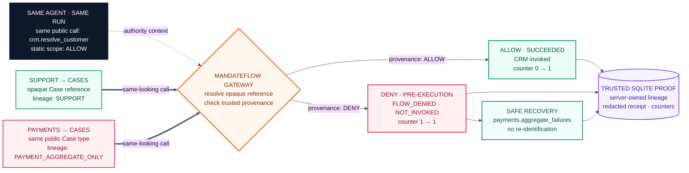

# MandateFlow — hackathon one-page diagrams

> **Same agent. Same public call. Provenance changes the authorization outcome.**

## 1. Where MandateFlow fits

```mermaid
%%{init: {"theme":"base","themeVariables":{"fontFamily":"Inter, ui-sans-serif, system-ui, sans-serif","primaryTextColor":"#0f172a","lineColor":"#475569","clusterBkg":"#f8fafc","clusterBorder":"#cbd5e1"},"flowchart":{"curve":"basis","nodeSpacing":28,"rankSpacing":42}}}%%
flowchart LR
  classDef baseline fill:#ffffff,stroke:#64748b,color:#0f172a,stroke-width:1.5px
  classDef untrusted fill:#fff7ed,stroke:#ea580c,color:#7c2d12,stroke-width:2px
  classDef control fill:#eff6ff,stroke:#2563eb,color:#1e3a8a,stroke-width:1.8px
  classDef gateway fill:#ede9fe,stroke:#7c3aed,color:#3b0764,stroke-width:2.4px
  classDef state fill:#ecfeff,stroke:#0891b2,color:#164e63,stroke-width:1.8px
  classDef protected fill:#ecfdf5,stroke:#059669,color:#064e3b,stroke-width:1.8px

  subgraph codejam["CODEJAM BASELINE"]
    direction LR
    ui["React Playground<br/>run proof · inspect evidence"]:::baseline
    service["Fastify + AgentService<br/>trusted Run lifecycle"]:::baseline
    runner["AgentRunner<br/>per-Run bootstrap"]:::baseline
    runtime["Agent runtime<br/>Codex or fixture Runner"]:::untrusted

    ui --> service --> runner --> runtime
  end

  subgraph mandateflow["TRUSTED MANDATEFLOW"]
    direction LR
    authority["Authority lifecycle<br/>prepare · activate · finish<br/>retry · revoke"]:::control
    gateway["Go MCP Gateway<br/>authenticate · exact scope<br/>resolve lineage · pinned policy"]:::gateway
    sqlite[("Go-owned SQLite<br/>mandates · grants · lineage<br/>counters · receipts")]:::state
    fixtures["Protected fixtures<br/>Support · Payments · Cases · CRM<br/>execute only after ALLOW"]:::protected

    authority -.-> sqlite
    gateway <--> sqlite
    gateway ==>|only protected route| fixtures
  end

  service -.->|control path| authority
  runtime ==>|protected tool call| gateway

  style codejam fill:#f8fafc,stroke:#94a3b8,stroke-width:1.2px
  style mandateflow fill:#faf5ff,stroke:#a78bfa,stroke-width:1.5px
```

## 2. The proof judges should remember

**Voice-over:** “CodeJam still runs the agent. MandateFlow adds one trusted
gateway in front of protected tools. Both requests look identical to the
allowlist, but the gateway resolves the opaque Case reference back to its
lineage. Support is allowed and CRM’s counter moves from zero to one. Payment
is denied before execution, the counter stays unchanged, and the trusted
SQLite receipt proves why. The model can request the call; only the gateway
can authorize it.”

**Demo beat:** Show the Support path first, then replay the same CRM call from
Payment lineage. End on `FLOW_DENIED`, `counter 1 → 1`, and the redacted receipt.

**Scope:** Five typed fixture operations behind MandateFlow in a single-host
POC; this is not general DLP for arbitrary text, files, or network calls.
