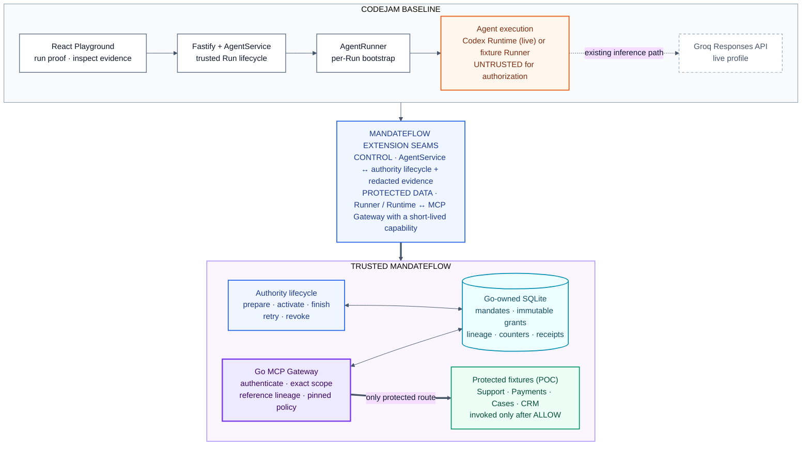
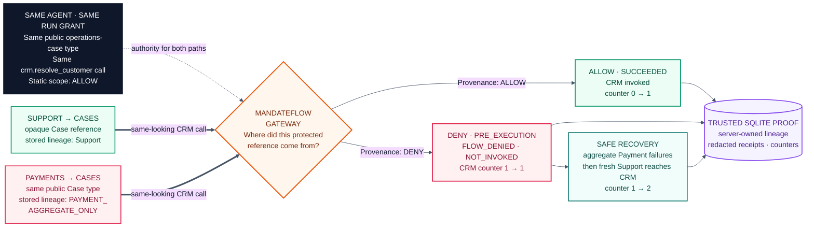

# MandateFlow — hackathon showcase diagrams

> **Same tool. Same public type. Different trusted provenance. Different authorization outcome.**

Use **Diagram 1** as the architecture slide: it shows exactly where MandateFlow
extends CodeJam and makes the trust boundary explicit. Use **Diagram 2** for the
live proof or as the next slide: it makes the allow/deny result understandable
without requiring the audience to know MCP or capability terminology.

## 1. Where MandateFlow fits into CodeJam

**Presenter cue:** CodeJam still owns the user experience, Agent lifecycle, and
Runtime. MandateFlow adds an authenticated control path and one exclusive
protected-tool path. The model can request a call; only the Go Gateway can
authorize and execute it. Node keeps only safe IDs and fingerprints; authority,
lineage, and receipt state remain Go-owned.

## 2. The proof judges should remember

**Presenter cue:** A normal allowlist sees two permitted calls to the same CRM
method. MandateFlow resolves where each opaque Case reference came from. The
Support-derived call executes; the Payment-derived call is stopped before CRM,
and the unchanged counter proves non-invocation. The blocking rule is
`NO_PAYMENT_REIDENTIFICATION`.

**Persistence proof:** Explicit Retry creates a new Run, Runtime, immutable
grant, and capability, but keeps the same policy context and stored Payment
lineage. The same CRM request is denied again without replaying the lookups.

---

**Scope boundary:** This proof covers five typed fixture operations placed
exclusively behind MandateFlow. It is a single-host POC, not general DLP for raw
text, files, arbitrary network calls, or production multi-tenant isolation.
